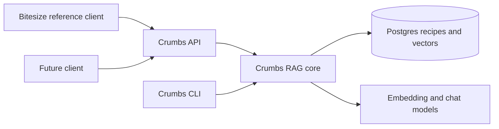
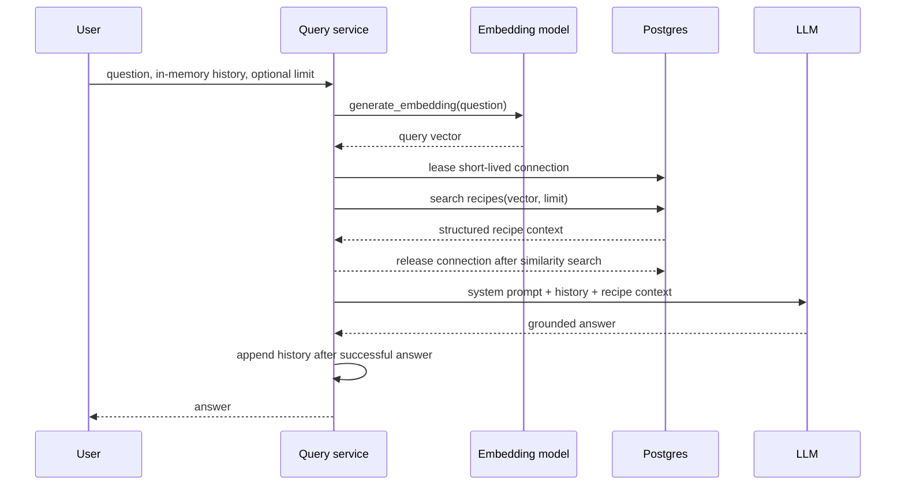

# Crumbs architecture

**Status:** Draft

## System boundary

Crumbs is the reusable RAG layer and owns recipe ingestion, structured recipe
storage, embeddings, similarity retrieval, and grounded response generation.
Clients consume these capabilities through a future HTTP API rather than
importing Python modules or connecting directly to Postgres. Bitesize is the
first reference client and belongs under `clients/bitesize/`; it is not part of
the RAG core.

## Repository layout

```text
src/app/          Python RAG, ingestion, database, and CLI code
clients/bitesize/ React/Vite reference client
backend/          Future shared Crumbs API layer
data/             Development recipe corpus and import inputs
docs/             Product, architecture, decision, and operating documentation
```

The Bitesize client remains independently runnable with its own JavaScript
dependencies. The future API translates the generic Crumbs recipe contract into
the client-facing response shape. Bitesize's existing Express backend and seed
data are not copied into this repository because they represent a separate
recipe schema and persistence flow.

## Client data flow



The MVP uses one shared corpus for multiple users. Conversation history is
isolated per active application session and is not shared between users. A
future multi-blog deployment must add an explicit corpus or tenant scope to
recipe writes and retrieval before independent corpora are enabled.

## Components

- The shared embedding component creates one vector for either a recipe text or
  a user question using the configured embedding model.
- The query service coordinates conversation messages, similarity retrieval,
  prompt construction, and the LLM request.
- Postgres stores recipes and vectors. The running application owns conversation
  history in memory.
- The LLM receives system instructions, prior conversation messages, and the
  selected recipe context. It does not select the retrieval limit.

## Data flow



The application chooses `limit`, using `3` by default, and passes it to a
retrieval operation equivalent to `search_similar_recipes(question, limit)`.
The retrieval operation embeds the question through the shared helper before
leasing a database connection, then uses vector similarity ordering against
`recipes.embedding`. The connection is held only for the similarity query and
is released before the LLM request begins.

## Persistence

The existing `recipes` table remains the source of recipe content and vectors.
The query feature does not add conversation tables. The running application
maintains an ordered in-memory history of user and assistant messages. System
instructions remain application-controlled rather than becoming user-editable
history. Conversation history has no database identifier and is never persisted.
Exiting the process discards the history.

The query flow generates the query embedding before leasing a connection, reads
the selected recipe context from Postgres, releases the connection for the LLM
request, and then appends the user and assistant messages to in-memory history.
If embedding, retrieval, or the LLM request fails, history is not appended.

## Prompt boundary

The system prompt defines the assistant's behavior and guardrails. Retrieved
recipes are provided as context data, separate from the system instructions.
In-memory conversation history provides continuity during the process lifetime
but cannot override the system prompt or authorize the assistant to invent facts
absent from the retrieved recipes. Recipe responses are instructed to include
the title, source URL when available, ingredients, and numbered instructions;
recipes without a source URL are identified as having no external link.
