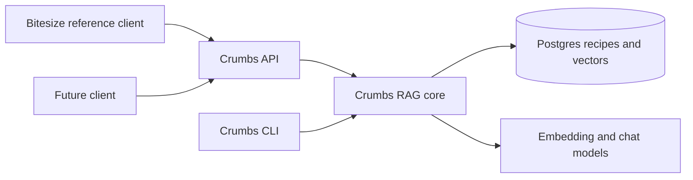
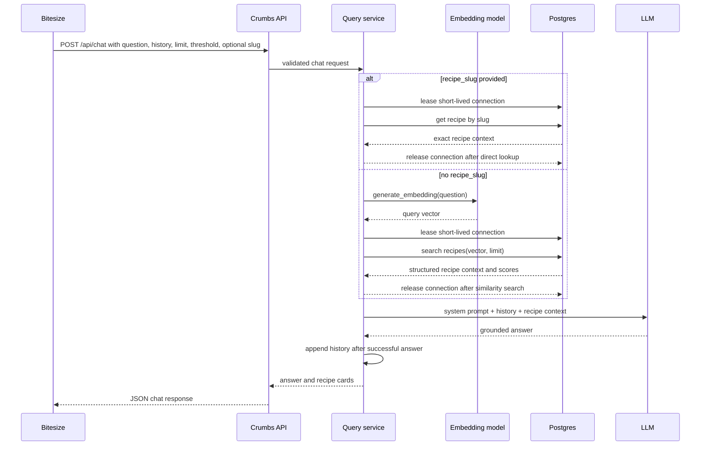

# Crumbs architecture

**Status:** Approved for current MVP direction

## System boundary

Crumbs is the reusable RAG layer and owns recipe ingestion, structured recipe
storage, embeddings, similarity retrieval, and grounded response generation.
Clients consume these capabilities through the shared HTTP API rather than
importing Python modules or connecting directly to Postgres. Bitesize is the
first reference client and belongs under `clients/bitesize/`; it is not part of
the RAG core.

## Repository layout

```text
src/app/          Python RAG, ingestion, database, API, and CLI code
clients/bitesize/ React/Vite reference client
data/             Development recipe corpus and import inputs
docs/             Product, architecture, decision, and operating documentation
```

The Bitesize client remains independently runnable with its own JavaScript
dependencies. The shared API translates the generic Crumbs recipe contract into
the client-facing response shape. Bitesize's existing Express backend and seed
data are not copied into this repository because they represent a separate
recipe schema and persistence flow.

## Stable client contract

The implemented `POST /api/chat` endpoint accepts a question, ordered in-memory history, an
optional application-selected retrieval limit, an optional similarity
threshold, and an optional recipe slug. It returns an object containing the
assistant `answer` and `recipe_cards`. A recipe card contains the persisted
`slug`, `title`, category and tag arrays, time and nutrition metadata, and
numeric `similarity_score`. These are the same condensed fields used by the
home-page recipe cards. The slug is the only navigation identifier exposed to
the client; embeddings and database implementation details are not returned.

The application uses `3` as the default retrieval limit. There is no
product-level maximum in the MVP. The client may render the similarity score as
small, light-gray supporting text.

## Client data flow



The MVP uses one shared corpus for multiple users. Conversation history is
isolated per active application session and is not shared between users. A
future multi-blog deployment must add an explicit corpus or tenant scope to
recipe writes and retrieval before independent corpora are enabled.

## Components

- The shared embedding component creates one vector for either a recipe text or
  a user question using the configured embedding model.
- The query service coordinates conversation messages, similarity retrieval,
  prompt construction, and the LLM request.
- Postgres stores recipes and vectors. The running application owns conversation
  history in memory.
- The LLM receives system instructions, prior conversation messages, and the
  selected recipe context. It does not select the retrieval limit.

## Data flow



The application chooses `limit`, using `3` by default, and passes it to
`process_query_result`. With no `recipe_slug`, the function embeds the question
through the shared helper, leases one database connection, and uses vector
similarity ordering against `recipes.embedding`. With a `recipe_slug`, it
directly retrieves that exact recipe and skips embedding and similarity search.
In both paths, the connection is released before the LLM request begins. Only
the similarity-search path produces scored recipe cards; the selected recipe is
already represented by the detail page.

## Persistence

The existing `recipes` table remains the source of recipe content and vectors.
The query feature does not add conversation tables. The running application
maintains an ordered in-memory history of user and assistant messages. System
instructions remain application-controlled rather than becoming user-editable
history. Conversation history has no database identifier and is never persisted.
Exiting the process discards the history.

For general questions, the query flow generates the query embedding before
leasing a connection and reads the selected complete recipe context and
similarity scores from Postgres. For recipe-specific questions, it reads the
complete recipe directly by slug without generating an embedding. The
similarity results can be projected into condensed recipe cards for the client.
Retrieved recipe context is request-scoped and is not appended to history. The
user and assistant messages are appended to in-memory history only after a
successful answer. If embedding, retrieval, or the LLM request fails, history
is not appended.

## Prompt boundary

The system prompt defines the assistant's behavior and guardrails. Retrieved
recipes are provided as context data, separate from the system instructions.
In-memory conversation history provides continuity during the process lifetime
but cannot override the system prompt or authorize the assistant to invent facts
absent from the retrieved recipes. Recipe responses are instructed to include
the title, source URL when available, ingredients, and numbered instructions;
recipes without a source URL are identified as having no external link.
